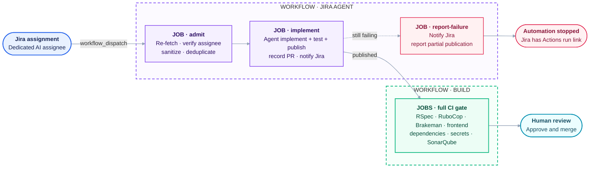

# Jira-to-PR agent deployment

The automation uses step-scoped credentials:

```text
Jira assignment -> queued dispatch -> sanitized context -> configured coding agent
  -> implementation and agent-run checks -> agent commit/push/PR
  -> record publication -> complete CI
  -> human review and merge
```

The implementation job exposes Bedrock, OpenRouter, or ChatGPT credentials and the
scoped PR bot token only to the selected agent invocation. The invocation implements,
tests, commits, pushes its assigned branch, and creates the pull request. One final
cleanup clears residual values after the invocation.

## End-to-end flow



Claude Code or Codex runs on GitHub runners with the configured model provider. A
single invocation implements the ticket, runs every applicable approved check, fixes
failures, standardizes the commit and PR metadata, and publishes the PR before
returning. The workflow does not resume or invoke the model again. Before the agent
runs, the workflow copies the patch validator outside the editable worktree and
registers it as a pre-push hook. The hook blocks unsafe patches before publication.
After the invocation, the workflow records the agent-reported PR and adds a visible
job summary; it does not rerun tests or revalidate the published PR. Build CI then
runs independently on the PR, which remains for human review.
All implementation adapters receive `PR_BOT_TOKEN` as `GH_TOKEN`; model-provider
authentication remains separate.

## Deployment setup

### 1. Create the Jira bot service account

1. Open **Atlassian Administration > Directory > Service accounts**.
2. Select **Create a service account**, then select app **Jira** and role **User**.
3. Add it to a project role or group with only these project permissions:
   - Browse Projects
   - Add Comments
   - Assignable User
   - Access through any issue-security scheme used by the project
4. Open the account, select **Create credentials > API token**, and set an expiration.
5. Select these recommended classic Jira scopes:
   - `read:jira-work`
   - `write:jira-work`
6. Copy the token into the GitHub repository secret `JIRA_AGENT_API_TOKEN`.


### 2. Find the Jira values

1. Open `https://<site>.atlassian.net/_edge/tenant_info` and copy `cloudId`:

   ```json
   {"cloudId":"345t435g-c736-4775-9c99-sdfgsdf"}
   ```

2. Set `JIRA_BASE_URL` to `https://api.atlassian.com/ex/jira/<cloudId>`.
3. Open the bot under **Directory > Service accounts**. In a URL shaped like the
   following, copy the complete value after `/service-accounts/` as
   `JIRA_AGENT_ACCOUNT_ID`:

   ```text
   https://admin.atlassian.com/o/<organization-id>/service-accounts/<account-id>?tab=credentials
   ```

### 3. Configure the GitHub repository

1. Create the `jira-agent-runtime` GitHub Environment.
2. Add these repository variables:

   | Variable | Value |
   | --- | --- |
   | `JIRA_BASE_URL` | `https://api.atlassian.com/ex/jira/<cloudId>` |
   | `JIRA_AGENT_ACCOUNT_ID` | Complete Jira service-account ID |
   | `CODING_AGENT` | `claude-code` or `codex` |
   | `MODEL_PROVIDER` | `bedrock`, `openrouter`, or `chatgpt` for Codex only |
   | `MODEL_ID` | Exact model ID |
   | `AWS_ROLE_ARN` | Required for Bedrock only |
   | `AWS_REGION` | Required for Bedrock only |

3. Add these repository secrets:

   | Secret | Purpose |
   | --- | --- |
   | `JIRA_AGENT_API_TOKEN` | Scoped Jira service-account token |
   | `PR_BOT_TOKEN` | Let the agent push its assigned branch and create its pull request |
   | `OPENROUTER_API_KEY` | Required for OpenRouter only |
   | `CODEX_AUTH_JSON` | Required for Codex with ChatGPT only |

4. Run **Validate Jira Agent Deployment** before enabling Jira Automation.

Supported combinations:

| Coding agent | Bedrock | OpenRouter | ChatGPT |
| --- | --- | --- | --- |
| Claude Code | Yes | Yes | No |
| Codex | Yes | Yes | Yes |

### 4. Create `PR_BOT_TOKEN`

1. Open **GitHub Settings > Developer settings > Personal access tokens > Fine-grained
   tokens > Generate new token**.
2. Set the repository owner, select only this repository, and choose the shortest
   practical rotation period.
3. Grant repository permissions:
   - **Contents: Read and write**
   - **Pull requests: Read and write**
   - Metadata read access is added automatically.
4. Save the token as the GitHub repository secret `PR_BOT_TOKEN`.

### 5. Create the GitHub dispatch token

Create a second fine-grained token for Jira dispatches:

1. Open **GitHub Settings > Developer settings > Personal access tokens > Fine-grained
   tokens** and select **Generate new token**.
2. Set the resource owner to the repository owner and choose an appropriate expiration.
   Organization policy may require an owner to approve the token.
3. Under **Repository access**, select **Only select repositories** and select this
   repository.
4. Under **Repository permissions**, grant **Actions: Read and write**. Do not add
   Contents or Pull requests write permission to this token.
5. Generate the token, copy it once, and keep it separate from `PR_BOT_TOKEN`.

The dispatch token only starts `jira-agent.yml`. Never reuse `PR_BOT_TOKEN` here.

### 6. Create the Jira Automation rule

In the relevant Jira space, open **Spaces settings > Automation**, create a rule,
and configure it as follows:
Configure:
1. Trigger: **Work item assigned**
2. Condition: **Smart values condition**
   - First value: `{{assignee.accountId}}`
   - Condition: `equals`
   - Second value: your Jira service account’s account ID
3. Action: **Send web request** using the `POST` method and this URL:

```text
https://api.github.com/repos/OWNER/REPOSITORY/actions/workflows/jira-agent.yml/dispatches
```

Replace `OWNER` and `REPOSITORY`, then configure these request headers:

| Header | Value | Jira setting |
| --- | --- | --- |
| `Accept` | `application/vnd.github+json` | Visible |
| `Authorization` | `Bearer <GitHub dispatch token>` | **Hidden** |
| `Content-Type` | `application/json` | Visible |
| `X-GitHub-Api-Version` | `2026-03-10` | Visible |

- Mark `Authorization` as **Hidden** before saving.
- Re-enter hidden values after duplicating or importing the action or rule.

Select a custom JSON request body and enter:

```json
{
  "ref": "main",
  "inputs": {
    "issue_key": "{{issue.key}}",
    "event_id": "{{automationRule.id}}:{{issue.id}}:{{now.toMillis}}"
  }
}
```

4. Save and enable the rule.
5. Assign a disposable ticket to the bot and verify:
   - Jira Automation reports a successful request.
   - A **Jira Agent** run appears in GitHub Actions.
   - Jira receives the accepted run URL.

Send only `issue_key` and `event_id`. GitHub re-fetches the issue, verifies the
assignee, and blocks duplicate open `ai/<issue-key>-*` pull requests.

## AWS OIDC and Bedrock

Use a role trust policy scoped to this repository's environment subject and GitHub's
STS audience. Replace the placeholders exactly:

```json
{
  "Version": "2012-10-17",
  "Statement": [{
    "Effect": "Allow",
    "Principal": {
      "Federated": "arn:aws:iam::AWS_ACCOUNT_ID:oidc-provider/token.actions.githubusercontent.com"
    },
    "Action": "sts:AssumeRoleWithWebIdentity",
    "Condition": {
      "StringEquals": {
        "token.actions.githubusercontent.com:aud": "sts.amazonaws.com",
        "token.actions.githubusercontent.com:sub": "repo:OWNER/REPOSITORY:environment:jira-agent-runtime"
      }
    }
  }]
}
```

The role permission policy should contain only the Bedrock inference actions required
by the selected model. Restrict resources to the configured Claude inference profile
and routed foundation models or to the selected OpenAI model on the Bedrock Mantle
path. Do not grant `bedrock:*`, Secrets Manager, S3, IAM, or repository publishing
access.

Use provider budgets and quotas as the deployment-level usage ceiling. The workflow
also enforces job timeouts, bounded agent turns/budgets, and the selected agent's
structured output contract.

For OpenRouter, the adapter runs the pinned Claude Code CLI directly against
`https://openrouter.ai/api` with `ANTHROPIC_AUTH_TOKEN`, while Codex uses the full Responses endpoint
`https://openrouter.ai/api/v1/responses`. Keep the API key in GitHub Secrets. Model
availability alone does not guarantee coding-agent compatibility; test each selected
model through the deployment validation workflow.

Claude Code uses native `--json-schema` output with both Bedrock and OpenRouter. The
adapter validates the returned structure locally before exposing the common
agent-neutral result.

## Required branch protection

Protect `main` and require a pull request, at least one human approval, conversation
resolution, and these checks from the **Build** workflow:

- Backend RSpec
- RuboCop
- Brakeman
- Frontend production build
- Dependency review
- Secret scan
- SonarQube

Do not allow the Jira agent AWS role, Jira dispatch identity, `PR_BOT_TOKEN`, or any
GitHub App used here to bypass protection, approve pull requests, merge, delete the
branch, or push to `main`. Do not enable auto-merge.

## Agent-run verification and retention

The Jira agent must run all applicable approved checks and resolve failures during its
single implementation invocation. The workflow does not rerun those checks or start a
repair invocation. A trusted pre-push hook blocks unsafe patches, and the Actions
logs remain available when the agent fails. Agent-reported check results are
advisory until the independent Build workflow passes. Build CI does not invoke AI or
modify the branch; human review and merge remain mandatory.

## Rollout checks

Before production assignment, exercise a disposable Jira project and confirm:

1. Reassigned, stale, malformed, duplicate, and non-AI tickets stop safely.
2. Concurrent assignments serialize and Jira receives each run URL.
3. Each intended coding-agent/provider pair invokes successfully; the Bedrock role
   cannot invoke models outside its configured allowlist.
4. Backend-only, frontend-only, shared, empty, binary, symlink, and protected-path
   changes take the expected pre-push validation path.
5. A local test failure is resolved and rerun within the single model invocation;
   neither Claude Code nor Codex is resumed or invoked a second time.
6. Build CI runs normally on the published PR and never modifies its branch.
7. Failed local automation retains its Actions logs; successful automation still
   cannot approve, merge, or bypass `main` protection.

All third-party Actions references are immutable commit SHAs. Review upstream release
notes and update those SHAs through an ordinary human-reviewed PR.

The current Brakeman baseline contains one documented `EOLRails` lifecycle finding
for Rails 7.2.3.1. CI runs every Brakeman check, requires a note on that single ignored
fingerprint, and fails if the entry becomes obsolete. Upgrade Rails in a dedicated PR;
do not broaden the ignore file.
